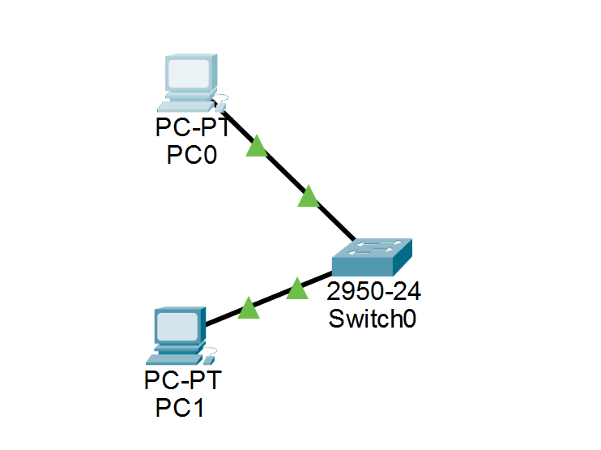
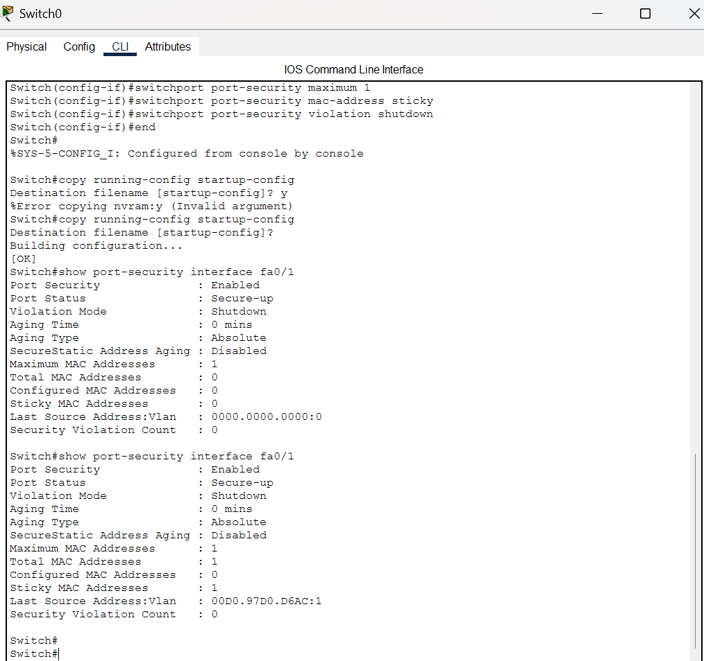
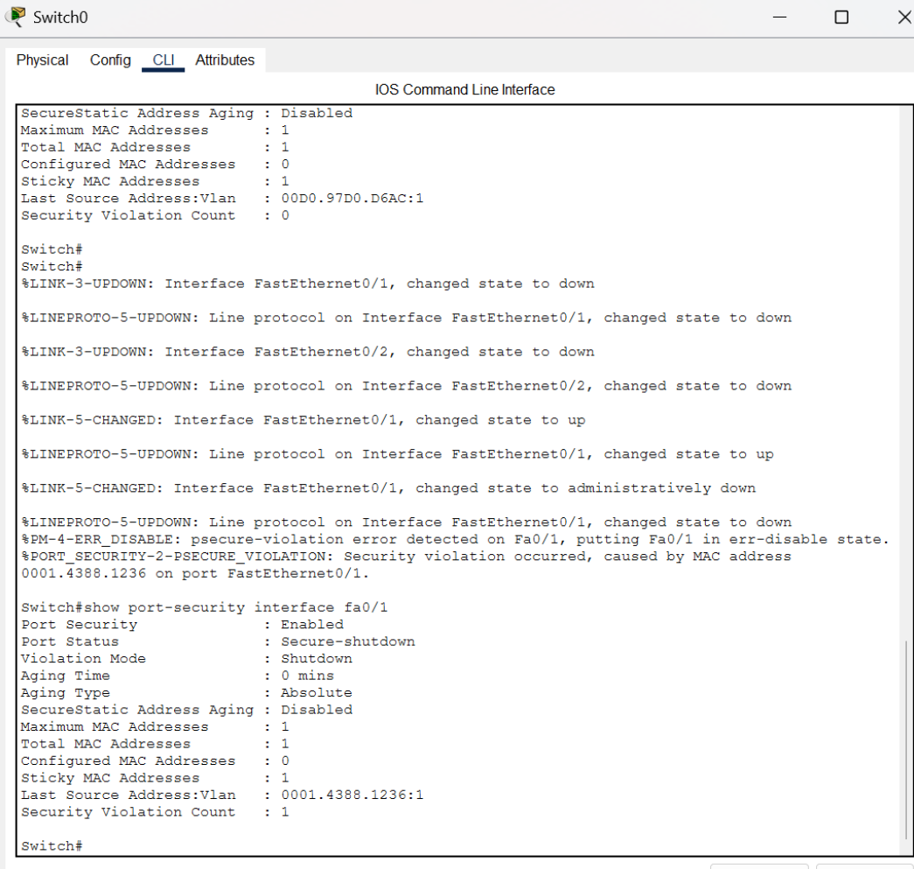

````markdown
# CCNA Lab 12 – Port Security

## Overview

This lab demonstrates how Port Security controls access to a switch port based on MAC addresses.

Two PCs were connected to a Cisco 2960 switch. Port Security was configured on one switch port with a maximum of one MAC address. Sticky MAC address learning was enabled to automatically learn the MAC address of the authorized device.

A security violation was then simulated by connecting an unauthorized device to the secured port. The switch detected the violation and automatically placed the port into a shutdown state.

## Objectives

- Understand the purpose of Port Security
- Configure a switch port as an access port
- Configure the maximum number of allowed MAC addresses
- Enable Sticky MAC address learning
- Configure the violation mode as shutdown
- Verify the secure MAC address
- Simulate an unauthorized device
- Observe a Port Security violation
- Verify that the switch shuts down the secured port

## Network Topology

Two Cisco PCs were connected to a Cisco 2960 switch.

```text
PC0 ───────── Fa0/1
                  \
                  SW0
                  /
PC1 ───────── Fa0/2
````

PC0 was initially connected to `Fa0/1`, which was configured as the secured port.

PC1 was connected to `Fa0/2` during the initial connectivity test.



## IP Addressing

The PCs were configured with the following IPv4 addresses:

| Device | IP Address   | Subnet Mask   |
| ------ | ------------ | ------------- |
| PC0    | 192.168.1.10 | 255.255.255.0 |
| PC1    | 192.168.1.20 | 255.255.255.0 |

Both PCs were configured in the same subnet to allow connectivity testing.

## Initial Connectivity Test

Before configuring Port Security, connectivity between the two PCs was verified using:

```cisco
ping 192.168.1.20
```

The ping was successful, confirming that the devices could communicate normally before applying the security configuration.

## Port Security Configuration

Port Security was configured on `FastEthernet0/1`.

The following configuration was applied:

```cisco
enable
configure terminal
interface fa0/1
switchport mode access
switchport port-security
switchport port-security maximum 1
switchport port-security mac-address sticky
switchport port-security violation shutdown
end
```

The port was configured to allow only one MAC address.

Sticky MAC learning was enabled so that the switch could dynamically learn the MAC address of the authorized device.

The violation mode was configured as `shutdown`, which causes the port to be disabled when an unauthorized MAC address is detected.

## Initial Port Security Verification

The following command was used to verify the Port Security configuration:

```cisco
show port-security interface fa0/1
```

After PC0 generated traffic, the switch successfully learned its MAC address as a Sticky MAC address.

The verification showed:

```text
Port Security              : Enabled
Port Status                : Secure-up
Violation Mode             : Shutdown
Maximum MAC Addresses      : 1
Total MAC Addresses        : 1
Configured MAC Addresses   : 0
Sticky MAC Addresses       : 1
Security Violation Count   : 0
```

This confirmed that PC0 was successfully registered as the authorized device on `Fa0/1`.



## Security Violation Test

To test Port Security, PC0 was disconnected from `Fa0/1`.

PC1 was then connected to the same secured port.

Because PC1 had a different MAC address from the one previously learned by the switch, the switch detected the device as unauthorized.

The configured `shutdown` violation mode was triggered.

## Security Violation Result

The following command was used to verify the result:

```cisco
show port-security interface fa0/1
```

The port was automatically placed into the `Secure-shutdown` state.

The verification showed:

```text
Port Security              : Enabled
Port Status                : Secure-shutdown
Violation Mode             : Shutdown
Maximum MAC Addresses      : 1
Total MAC Addresses        : 1
Sticky MAC Addresses       : 1
Security Violation Count   : 1
```

The switch also generated a security violation message indicating that an unauthorized MAC address was detected on `FastEthernet0/1`.



## Why Port Security Blocked the Device

The port was configured to allow only one secure MAC address.

PC0's MAC address was learned using Sticky MAC learning.

When PC1 attempted to access the same secured port using a different MAC address, the switch detected a security violation.

Because the violation mode was configured as `shutdown`, the switch automatically disabled the port.

This prevented the unauthorized device from accessing the secured switch port.

## Restoring the Port

The secured port was restored after completing the violation test using:

```cisco
enable
configure terminal
interface fa0/1
shutdown
no shutdown
end
```

The original topology was then restored with PC0 connected to `Fa0/1` and PC1 connected to `Fa0/2`.

The configuration was saved using:

```cisco
copy running-config startup-config
```

## Verification Command

The main command used throughout the lab was:

```cisco
show port-security interface fa0/1
```

This command was used to verify:

* Port Security status
* Port status
* Violation mode
* Maximum MAC addresses
* Total MAC addresses
* Sticky MAC addresses
* Security violation count

## What I Learned

* Port Security helps prevent unauthorized devices from accessing switch ports.
* Port Security can limit the number of MAC addresses allowed on a switch port.
* Sticky MAC learning allows the switch to dynamically learn and secure a device's MAC address.
* The maximum MAC address setting controls how many devices are allowed on a secured port.
* The `shutdown` violation mode disables the port when an unauthorized MAC address is detected.
* A security violation occurs when a different MAC address attempts to use a secured port.
* The `show port-security interface` command can be used to verify Port Security operation.
* Port Security provides an additional Layer 2 security mechanism for switched networks.
* Port Security can help control physical device access to the network.

## Author

**Kawthar Bader**
Computer Networks Student | CCNA Learner | Building Networking Labs

```
```
